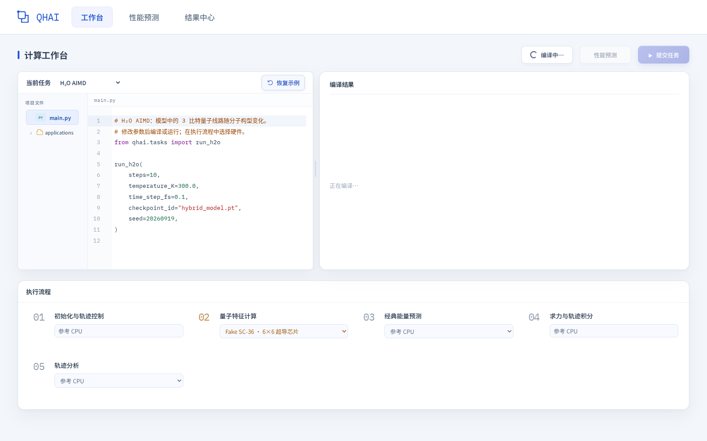
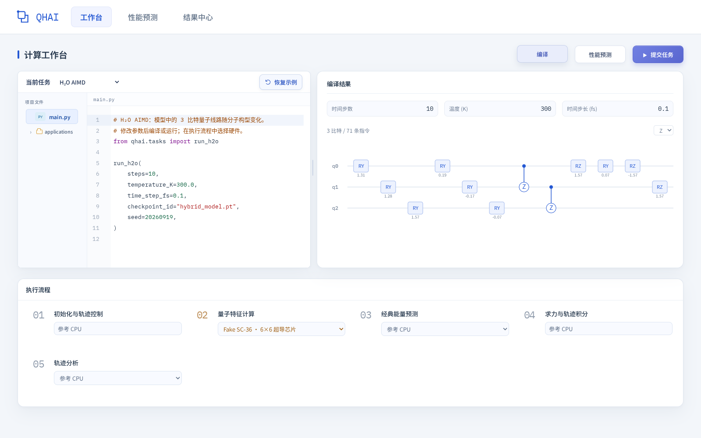
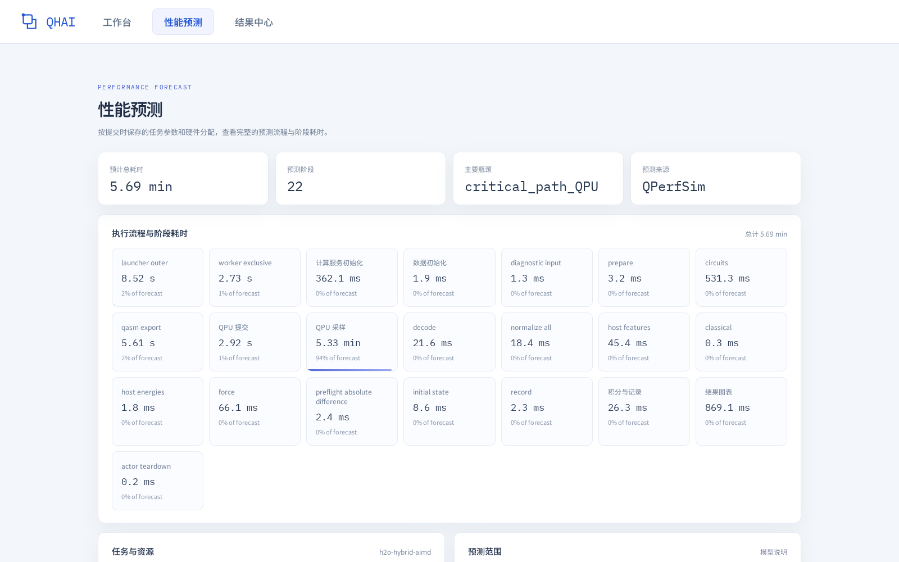
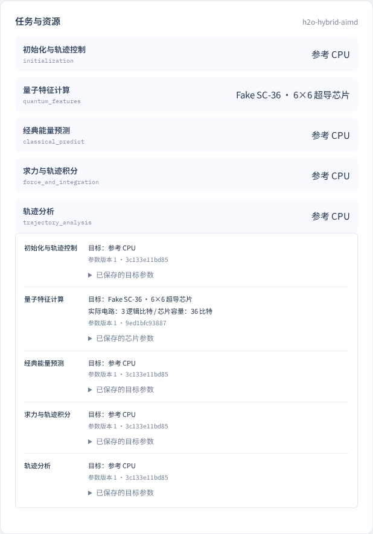
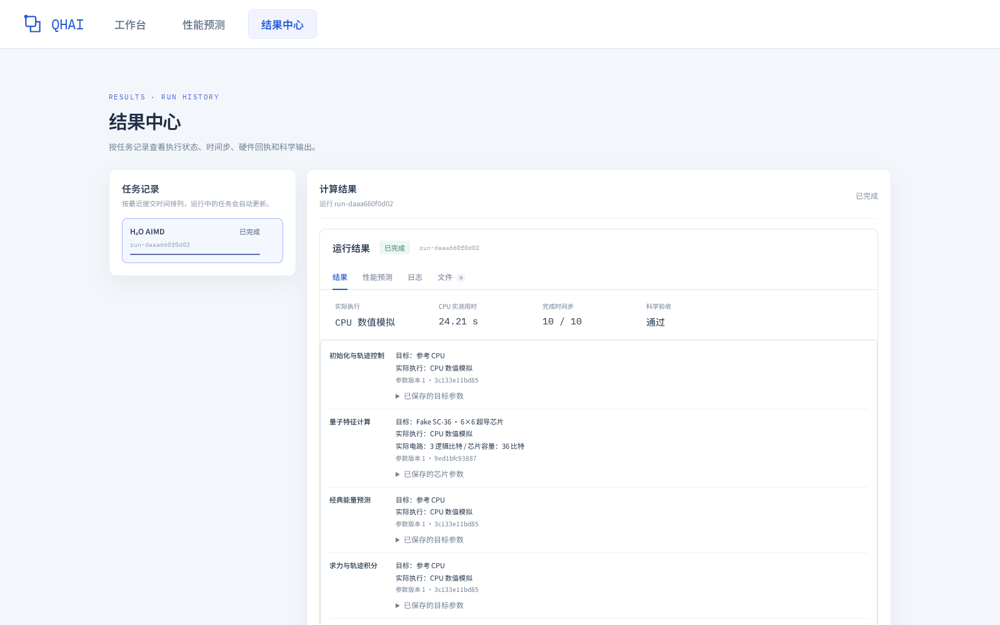
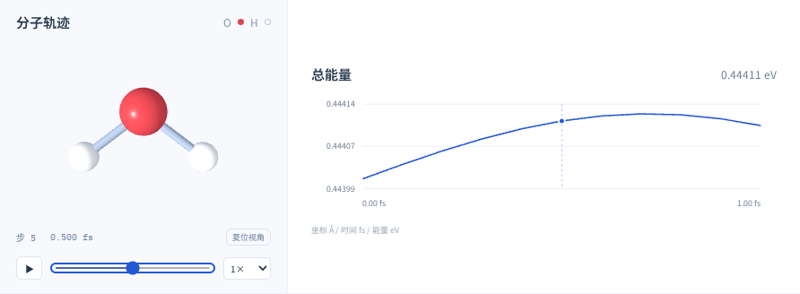

量超融合系统以**通用融合编程框架**为核心，将量子计算与经典计算组织在同一个程序流程中。用户编写计算组件、描述组件间的数据依赖，并明确指定各部分使用的 CPU 或 QPU 资源；框架按照这些声明协调任务执行，让不同硬件上的计算结果能够衔接起来。

系统将应用算法、任务执行和性能评估分开组织。应用层定义“计算什么”，融合编程框架负责“如何按依赖和资源要求执行”，性能模拟器帮助评估“在给定硬件配置下需要多长时间”，可视化工作台提供配置、提交和查看结果的入口。水分子 AIMD 是展示这一协作方式的一个应用示例；其他量子与经典混合应用也可以通过定义自己的计算组件和流程接入框架。

### 融合编程框架：连接组件、资源与执行

用户将程序拆分为可调用的计算组件，例如数据预处理、量子电路计算、经典模型推理和结果分析。每个组件声明所需的计算资源，再通过输入与输出连接上下游依赖。**使用哪一类硬件由用户指定**，框架据此提交任务、等待前置结果，并将结果交给后续组件。

框架基于 Ray 组织执行：独立调用可以作为任务运行，需要复用模型或设备连接的组件可以作为持有状态的服务运行。CPU 上的具体算法由应用组件实现，QPU 组件通过设备适配层提交量子电路、接收计算结果。新增应用时，开发者提供对应的组件与流程，复用框架的资源调度、依赖管理和结果传递能力。

### 性能模拟器：评估任务与硬件配置

性能模拟器接收应用侧准备的任务图和硬件参数。任务图描述各计算阶段、工作量、前后依赖以及数据传输，硬件参数描述计算能力、资源容量和设备间通信条件。模拟器据此估算总耗时、阶段耗时、吞吐与通信开销，帮助用户识别主要瓶颈、比较不同配置。

性能预测可以在连接真实 QPU 之前进行。用户根据预测结果调整任务参数或硬件分配，再决定提交的配置。预测描述目标硬件条件下的预计性能；任务运行记录则反映实际执行后端的实测时间，两者在界面中分别展示。

### 可视化工作台：配置任务与查看结果

工作台将应用代码、计算阶段和硬件分配呈现在同一操作流程中。用户可以查看和编辑已接入应用的代码与参数，检查其量子电路，为支持配置的阶段选择设备，再发起性能预测或提交任务。结果中心汇总运行状态、执行记录、日志和输出文件；具体应用还可以提供相应的结果视图。

例如，水分子 AIMD 示例提供能量曲线与分子轨迹，便于理解该应用的计算结果。新应用可以根据自己的输出提供相应的分析与展示方式。

### 各模块如何配合

一次混合计算通常沿着以下流程完成：

1. **编写应用与拆分组件**：由应用定义算法和输入输出，把经典计算、量子计算等步骤组织成完整流程。
2. **指定资源与依赖**：用户为组件声明目标硬件，并连接前后任务的数据依赖，形成执行配置。
3. **评估执行性能**：应用侧提供用于预测的任务描述，性能模拟器结合硬件配置估算耗时，供用户比较和调整。
4. **提交并执行任务**：融合编程框架根据用户确认的配置协调组件运行，将前序结果传给后续计算。
5. **查看结果与记录**：应用输出计算结果，工作台展示执行状态、日志与可视化内容，支持用户继续调整下一次计算。

在水分子 AIMD 示例中，这一流程表现为量子特征计算、经典能量预测、求力与轨迹积分之间的协作。分子模型和动力学算法由该应用提供，底层的组件组织、资源声明与任务执行机制则可供其他混合计算应用复用。

## 使用指南

本教程以水分子 AIMD 为例，介绍在计算平台中选择应用、编译电路、分配计算硬件、进行性能预测，以及提交任务和查看分子演化结果的操作流程。

本例使用 **CPU 与 QPU** 目标配置：经典计算阶段选择“参考 CPU”，量子特征计算选择虚拟目标“Fake SC-36”。截图来自同一组 10 步任务参数的实际操作；运行使用工作台的 **CPU 数值计算模式**，量子电路也由 CPU 数值模拟，不连接真实 QPU。水分子 AIMD 用于演示通用融合编程框架的操作方式。

操作顺序为：**选择应用 → 编译电路 → 分配硬件 → 性能预测 → 提交任务 → 查看结果**。

### 1. 选择应用并编译电路

进入平台的**工作台**，在“当前任务”下拉框中选择 **H₂O AIMD**。左侧代码编辑器会显示该应用的 `main.py`，可以在这里查看和修改计算参数。

本例使用以下代码：

```python
from qhai.tasks import run_h2o

run_h2o(
    steps=10,
    temperature_K=300.0,
    time_step_fs=0.1,
    checkpoint_id="hybrid_model.pt",
    seed=20260919,
)
```

其中，`steps` 为演化步数，`temperature_K` 为初始温度，`time_step_fs` 为时间步长；`checkpoint_id` 指定模型文件，`seed` 指定随机种子。本例从 300 K 开始，以 0.1 fs 的时间步长演化 10 步，总时长为 1 fs。

确认参数后，点击工作台右上方的**编译**。等待编译完成，右侧“编译结果”区域会显示解析出的计算参数和量子电路，便于检查应用的量子计算部分。修改代码参数后，可以再次点击“编译”更新结果。



*图 1：选择水分子 AIMD 应用并编译电路。*

---

### 2. 分配计算硬件并发起性能预测

编译完成后，在页面下方的**执行流程**中确认各任务阶段的目标计算硬件。对于提供下拉选项的阶段，可以选择对应的设备。

下图展示了一组示例配置：

| 任务阶段 | 目标计算硬件 |
| --- | --- |
| 初始化与轨迹控制 | 参考 CPU |
| 量子特征计算 | Fake SC-36 · 6×6 超导芯片 |
| 经典能量预测 | 参考 CPU |
| 求力与轨迹积分 | 参考 CPU |
| 轨迹分析 | 参考 CPU |

完成硬件分配后，点击右上方的**性能预测**。平台会根据当前任务参数和硬件配置，估算整个计算流程的执行耗时。



*图 2：为任务阶段选择目标硬件，然后点击“性能预测”。*

---

### 3. 查看性能预测结果

进入**性能预测**页面后，可以先查看顶部的预计总耗时、预测阶段数、主要瓶颈和预测来源，再查看“执行流程与阶段耗时”中各细分阶段的耗时及占比。

本例的预测总耗时为 **5.69 min**，包含 **22 个细分阶段**。其中，QPU 采样阶段约为 **5.33 min**，占预计总耗时的 **94%**，是本次配置下的主要耗时环节。这些数值对应图中的任务参数与 CPU/QPU 配置；调整参数或设备后，应重新进行性能预测。



*图 3：查看总体性能预测和各细分阶段的耗时。*

向下滚动，可以在**任务与资源**中核对五个任务阶段与目标硬件的对应关系，并展开已保存的参数。右侧**预测范围**说明了本次估算使用的硬件假设和模型范围。

本例水分子电路使用 **3 个逻辑比特**；Fake SC-36 的“36”表示示例芯片容量，其吞吐为每秒 10,000 shots、每批提交时延为 1 ms。经典 CPU 推理根据冻结模型的层尺寸估算工作量，采用峰值 **1 TFLOPS**、访存带宽 **100 GB/s** 的假设值；其他固定阶段沿用参考宿主开销。这些参数未经实际目标硬件标定，预测不代表实机测试结果，也不评价科学精度。



*图 4：核对 CPU/QPU 资源分配与已保存的参数快照（任务与资源区域）。*

---

### 4. 提交任务并查看运行状态

确认应用参数和硬件配置后，返回**工作台**，点击右上方的**提交任务**，开始水分子 AIMD 计算。

打开**结果中心**，在左侧“任务记录”中选择需要查看的任务。右侧会显示该任务的运行状态、实际执行方式、实测用时、完成时间步和科学验收状态。可以通过“结果”“性能预测”“日志”和“文件”页签查看对应内容。

图中的任务已完成 **10 / 10** 个时间步，实际执行方式为 **CPU 数值模拟**，CPU 实测用时为 **24.21 s**。这里的实测用时与前面的目标硬件预测耗时含义不同：前者记录本次 CPU 上的 AIMD 计算用时，后者估算所选 CPU/QPU 目标配置下的时间，不能直接作为同一硬件上的预测误差进行比较。实测时间随运行环境变化；这次短轨迹用于演示操作流程，不能替代完整的科学基准验证。



*图 5：选择任务记录，查看运行状态和计算结果。*

---

### 5. 查看水分子演化结果

在任务的**结果**页签中继续向下滚动，可以查看水分子的三维轨迹和总能量曲线。

- **播放与暂停**：点击分子轨迹下方的播放按钮，观察水分子随时间的演化；再次点击可暂停。
- **定位时间步**：拖动进度条，查看某个时间步的分子构型和对应时间。
- **调整播放速度**：使用速度下拉框改变轨迹播放速度。
- **复位视角**：点击“复位视角”，恢复默认的三维观察角度。
- **查看总能量**：结合右侧总能量曲线，观察这段演化过程中的能量变化。图中时间单位为 fs，能量单位为 eV。



*图 6：查看水分子轨迹与总能量随时间的变化。*

## 应用示例

- [水分子 AIMD](../examples/aimd/)：查看量子电路、示例代码、模拟曲线与数据。
- [QRAM](../examples/qram/)：了解量子随机访问存储。
