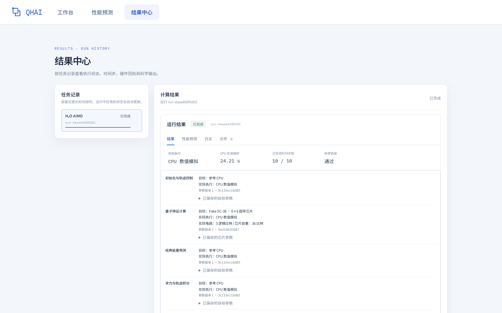

水分子中的氧原子和两个氢原子会随时间移动。程序从它们当前的位置预测能量，计算能量随位置的变化以得到各原子的受力，再用力更新位置。重复这一过程，就得到一段分子运动轨迹。

本教程使用预先训练好的量子-经典代理势能模型。严格的“从头算分子动力学”（AIMD）通常在每一步重新计算电子结构；这里的计算方式是：量子电路提供数值特征，经典模型预测能量，程序据此求力，并不在每一步重新求解电子结构。

本教程用 10 个时间步演示水分子动力学模拟的工作台操作：选择应用、编译电路、分配设备、预测耗时、提交任务并检查结果。历史工作台与以下截图中的应用标签为 **H₂O AIMD**。

先按照文档中[“启动工作台”](../#启动工作台)一节的说明，在本机启动 Docker 工作台，再在浏览器打开 `http://127.0.0.1:8787/`。本教程操作的是该工作台；当前静态网站只展示文档和已保存的教程内容。

本例使用 **CPU 与 QPU** 目标配置：经典计算阶段选择“参考 CPU”，量子特征计算选择虚拟目标“Fake SC-36”。截图来自同一组 10 步任务参数的实际操作；运行使用工作台的 **CPU 数值计算模式**，量子电路也由 CPU 数值模拟，不连接真实 QPU。

## 1. 选择应用并编译电路

进入平台的**工作台**，在“当前任务”下拉框中选择 **H₂O AIMD**。左侧代码编辑器会显示该应用的 `main.py`，可以在这里查看和修改计算参数。

以下代码是工作台编辑器支持的应用配置语法；它由工作台解析，不能直接作为 `pivotq` Python SDK 的导入代码使用。

本例使用以下代码：

```python
from qhai.tasks import run_h2o

run_h2o(
    steps=10,
    temperature_K=300.0,
    time_step_fs=0.1,
    checkpoint_id="hybrid_model.pt",
    seed=20260919,
)
```

其中，`steps` 为演化步数，`temperature_K` 为初始温度，`time_step_fs` 为时间步长；`checkpoint_id` 指定模型文件，`seed` 指定随机种子。本例从 300 K 开始，以 0.1 fs 的时间步长演化 10 步，总时长为 1 fs。

确认参数后，点击工作台右上方的**编译**。等待编译完成，右侧“编译结果”区域会显示解析出的计算参数和量子电路，便于检查应用的量子计算部分。修改代码参数后，可以再次点击“编译”更新结果。


*图 1：选择水分子动力学模拟应用并编译电路。*

---

## 2. 分配计算硬件并发起性能预测

编译完成后，在页面下方的**执行流程**中确认各任务阶段的目标计算硬件。对于提供下拉选项的阶段，可以选择对应的设备。

| 任务阶段 | 目标计算硬件 |
| --- | --- |
| 初始化与轨迹控制 | 参考 CPU |
| 量子特征计算 | Fake SC-36 · 6×6 超导芯片 |
| 经典能量预测 | 参考 CPU |
| 求力与轨迹积分 | 参考 CPU |
| 轨迹分析 | 参考 CPU |

完成硬件分配后，点击右上方的**性能预测**。平台会根据当前任务参数和硬件配置，估算整个计算流程的执行耗时。


*图 2：为任务阶段选择目标硬件，然后点击“性能预测”。*

---

## 3. 查看性能预测结果

进入**性能预测**页面后，可以先查看顶部的预计总耗时、预测阶段数、主要瓶颈和预测来源，再查看“执行流程与阶段耗时”中各细分阶段的耗时及占比。

前面选择了 **5 个任务阶段**的目标设备，性能预测会将它们展开为 **22 个用于估算耗时的细分阶段**。本例预计总耗时为 **5.69 min**；其中 QPU 采样预计用时 **5.33 min**，约占总时间的 **94%**。这些数值对应图中的任务参数与 CPU/QPU 目标配置；调整参数或设备后，应重新预测。


*图 3：查看总体性能预测和各细分阶段的耗时。*

向下滚动，可以在**任务与资源**中核对五个任务阶段与目标硬件的对应关系，并展开已保存的参数。右侧**预测范围**说明了本次估算使用的硬件假设和模型范围。

本例水分子电路使用 **3 个逻辑比特**；Fake SC-36 的“36”表示教程假设的芯片容量。预测中假设其每秒可完成 10,000 次电路运行与测量（shots），每批提交时延为 1 ms。经典 CPU 推理的工作量根据冻结模型的各层规模估算，计算峰值和访存带宽分别假设为 **1 TFLOPS** 和 **100 GB/s**；其他固定阶段采用参考宿主机的开销估计。这些参数未经实际目标硬件标定，预测不代表实机测试结果，也不评价科学精度。


*图 4：核对 CPU/QPU 资源分配与已保存的参数快照（任务与资源区域）。*

---

## 4. 提交任务并查看运行状态

确认应用参数和硬件配置后，返回**工作台**，点击右上方的**提交任务**，开始水分子动力学模拟计算。

打开**结果中心**，在左侧“任务记录”中选择需要查看的任务。右侧会显示该任务的运行状态、实际执行方式、实测用时、已完成的时间步数和科学验收状态。可以通过“结果”“性能预测”“日志”和“文件”页签查看对应内容。

图中的任务完成了 **10 / 10** 个时间步，实际使用 **CPU 数值模拟**，实测用时为 **24.21 s**。前面的 **5.69 min** 是参考 CPU 加虚拟 QPU“Fake SC-36”目标配置的预计用时；这次运行没有使用目标 QPU，因此不能用这两个数字计算预测误差。实测时间会随运行环境变化；这段短轨迹用于演示操作流程，不能替代科学精度验证。



*图 5：选择任务记录，查看运行状态和计算结果。*

---

## 5. 查看水分子演化结果

在任务的**结果**页签中继续向下滚动，可以查看水分子的三维轨迹和总能量曲线。

- **播放与暂停**：点击分子轨迹下方的播放按钮，观察水分子随时间的演化；再次点击可暂停。
- **定位时间步**：拖动进度条，查看某个时间步的分子构型和对应时间。
- **调整播放速度**：使用速度下拉框改变轨迹播放速度。
- **复位视角**：点击“复位视角”，恢复默认的三维观察角度。
- **查看总能量**：结合右侧总能量曲线，观察这段演化过程中的能量变化。图中时间单位为 fs，能量单位为 eV。


*图 6：查看水分子轨迹与总能量随时间的变化。*
